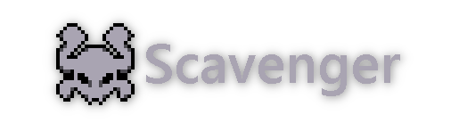

<p align="center">
    <br>
  "The no nonsense barebones pure PHP framework."
</p>

A simple PHP barebones backend framework for smaller scale projects that don't need anything extensive or complicated
such
as [Laravel](https://github.com/laravel/laravel). You provide the clientside environment yourself.

> [!CAUTION]
> This is **alpha** quality software, and I provide absolutely **zero guarantee** of features working without issues or
> even
> working at all. Scavenger will continue to be updated as alpha software until it is considered stable enough to note
> otherwise.

## Features

As the goal of the project is to keep things _minimal_ it only contains bare minimum to get things going.

- [Twig](https://twig.symfony.com/) for easy templating.
- [Peece's simple-router](https://github.com/skipperbent/simple-php-router) for neat routing. (Seriously star it, It's
  underrated as hell!)
- [Pearls](#pearls) for file containerization.

### Pearls

Pearls are a convenient way to encapsulate and manage resources in the app. Whether it's external images, documents, or
any other files, Pearls provide a containerized approach to safeguard these assets.

They ensure that files are stored and served safely without the risk of tampering, unauthorized modifications, or
accidental execution during transport between the client and server.

#### Example:

Setting data:

```php
$pearl = new Pearl("test", "test");
$pearl->setData("string", DataType::Text, "a");
$pearl->setData("integer", DataType::Integer, 42);
$pearl->setData("image", DataType::Binary, file_get_contents(APP_ROOT . "/test.png"));
$pearl->flush();
```

Getting data:

```php
$pearl = new Pearl("test", "test");
print("String: {$pearl->getData("string")}<br>");
print("Integer: {$pearl->getData("integer")}<br>");
print("Image: getData("image")) . "\" \>");
```

### Misc

Scavenger introduces some new constants into PHP:

- `PROJECT_ROOT` - Being the root of the project. (Where for example, `config.ini` resides.)
- `APP_ROOT` - Application root. (The `App` folder.)
- `SCAVENGER_ROOT` - Represents the root of Scavenger's internals. For internal use only.
- `SCAVENGER_CONFIG` - Represents an associative array of the `config.ini` file. Mainly used for internals.

> [!IMPORTANT]
> Under no circumstances, should `{APP_ROOT}/Public/index.php` be ever edited. Use `{APP_ROOT}/Header.php` for custom
> initialization code. Doing so could lead to merge errors while updating Scavenger.

## Installation

1. Fork this repository then clone it to a local directory.
2. Execute `composer i` in the project directory.
3. Copy the config.ini file and modify the value(s) to your liking.
4. You've made a Scavenger project!
5. _Optionally;_ Delete the `.github` directory and add it to your `.gitignore`.

### Webserver configuration.

As Scavenger relies on a router script to function, you need to fall back to the index.php script in an event of the URL
not being a valid path on the filesystem. e.g. The user requesting an url of `/user/1`.

Example with NGINX:

```nginx
try_files $uri $uri/ /index.php;
```

## Closing notes

The reason why I made Scavenger was because I was very displeased after seeing how complex Laravel is for the scope of
my projects, I don't need database ORMs or other fancy-schmaltzy things.

Hopefully you'll find Scavenger useful for one of your projects.

> [!NOTE]
> _Sigh_, of course when I'm slightly invested into the project I find out that someone
> already [beat me to it.](https://codeigniter.com/) _(It seems like a really cool project... Go star it I guess!)_ But that won't stop me! _(Who knows, maybe Scavenger be even smaller!)_

_Rain World is a registered trademark of Videocult, LLC, all rights belong to them._  
_Lizard hiss~_ Oh, sorry. _Meow..._